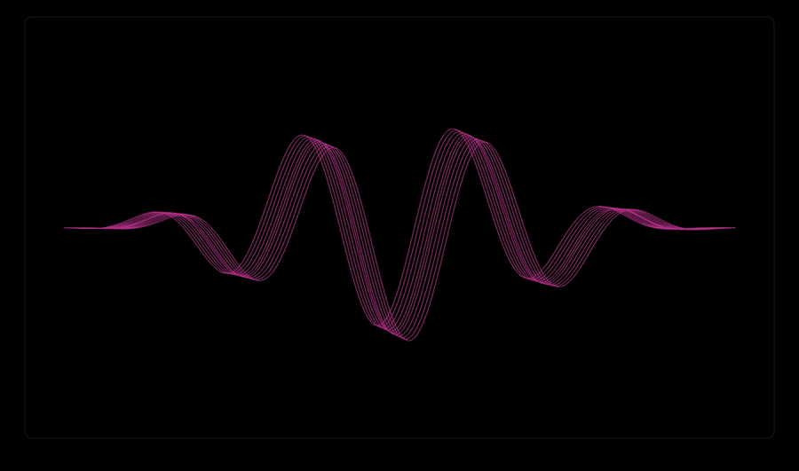

<div align="center">

<h1>Waveform Generator 〰️</h1>

<p>
  <strong>An audio-reactive waveform renderer for high-quality video overlays. 
</strong>
</p>

<br>

<p>
  
  
  
  
</p>

<p>
  
  
</p>

</div>

---

## 📖 Project Overview

**Waveform Generator** is a Python application that transforms audio files into animated, audio-reactive waveform videos. The waveform responds to changes in loudness and can be customized using a hexadecimal colour value. It is a VEED - inspired app (kind of a free alternative to its Audio Waveform Generator tool :))

The project provides both a **PySide6 desktop interface** and a **FastAPI web interface**. Both interfaces use the same waveform-processing engine, keeping the audio analysis and rendering logic in one place.

The application supports **transparent ProRes 4444 exports** in landscape and vertical formats, with the option to include or exclude the original audio. These videos can be later imported into video editors and placed over other footage.

> **Note:** One of the strengths of this project lies in the flexible audio input. It allows the user to input various formats like WAV, MP3, M4A and even MOV/MP4 if they contain an audio stream. Another strength is that it supports high-quality FullHD (1080p) exports in both landscape and vertical formats.

---

## 🎬 Demo

> This preview shows how the waveform responds to changes in loudness.


> The desktop interface:
> The web interface:

## 🧩 Project Structure
This repository is a monorepo containing two interfaces and one shared waveform-processing engine.
```text
WaveformGenerator/
├── desktop_app/
│   └── gui.py                  # desktop interface
│
├── web_app/
│   ├── static/
│   │   └── style.css           # Web interface
│   ├── templates/
│   │   └── index.html          # Upload and export form
│   └── app.py                  # FastAPI routes / file handling
│
├── waveform_engine.py          # Audio analysis and video rendering
├── requirements.txt            # Python dependencies
├── .gitignore                  # Files excluded from Git
└── README.md                   # Project documentation
```

### 1. Shared waveform engine (waveform_engine.py)
The technical core of the project. Used by both desktop and web interfaces.
- Roles:
  - Decodes input media through FFmpeg
  - Converts the audio into mono PCM samples
  - Measures RMS loudness for every video frame
  - Draws the animated waveform using Pillow and NumPy
- Highlights:
  - Normalizes the loudness values
  - Streams frames directly to FFmpeg
  - Exports transparent ProRes 4444 video

### 2. Desktop interface (/desktop_app)
A local graphical interface built with PySide6. It allows the user to:
- select an audio/video file
- choose the waveform color in hex
- select an export format (vertical/horizontal, with/without sound)
- choose output location

### 3. Web interface(/web_app)
A local web interface built with FastAPI, HTML, and CSS.
- Roles:
  - Receives the uploaded file and some export settings
  - Calls the waveform engine
  - Returns the video as a download
- Highlights:
  - Temporarily stores the uploaded file
  - Removes temporary files after response is complete

> **Architecture note**: The desktop and web interfaces do not duplicate the signal-processing logic. Both call the same Python waveform engine, which keeps rendering behaviour consistent across the application.

## 💡 Key Features
- **Audio-reactive movement:** The waveform grows/contracts according to the changing RMS energy of the input audio.
- **Smooth animation:** Separate attack and release factors prevent abrupt movements.
- **Transparent video export:** Generates ProRes 444 MOV files with an alpha channel
- **Optional embedded audio:** Exports can include the original soundtrack or contain only the waveform.
- **Two user interfaces:** Provides both a PySide^ desktop interface and a FastAPI one.
- **Direct frame streaming:** The engine creates one frame at a time and sends its raw pixels directly to FFmpeg through an input pipe. This avoids saving thousands of temporary PNG files and keeps disk and memory usage under control.

## 🎧 Audio Engineering
The waveform animation is driven by the changing loudness of the given audio. The engine does not display the original audio signal directly. Instead, it measures the audio's energy over time and uses that information to control a multi-strand waveform.

> **Audio-quality note:** Audio analysis and final audio export follow separate paths. FFmpeg creates a 24 kHz mono representation only for calculating movement. For exports with audio, FFmpeg reads the original input again and preserves its original channel layout as uncompressed 24-bit PCM.

### 1. Audio decoding
FFmpeg decodes the input into raw audio data that is:
- converted to mono
- resampled to 24,000 samples/second
- converted to 32-bit floating-point PCM
- interpreted by NumPy as an array of numbers

> Format note: FFmpeg allows the engine to accept common formats such as WAV, MP3, M4A, AAC, and FLAC, as well as MOV and MP4 files containing an audio stream. Compatibility depends on the codecs available in the installed FFmpeg build.

### 2. Audio samples and video frames
The video runs at 30 frames per second, while the decoded audio contains 24,000 samples per second.
 => each video frame has 800 audio samples and for each of these frames, RMS is calculated to find out the amplitude:
    ```python
    rms = np.sqrt(np.mean(frame_samples ** 2))
    ```
> Important: The current engine performs amplitude analysis, not frequency analysis. It does not currently use a Fourier transform or separate the audio into bass, midrange, and treble frequencies.

### 3. Smoothing and normalizing the movement
Raw loudness values can change suddenly, so the engine uses:
- **Attack:** controls how quickly the waveform grows when the audio becomes louder.
- **Release:** controls how gradually it shrinks when the audio becomes quieter.

Because audio files can have different recording levels, the smoothed values are normalised using their 95th percentile as a reference. The final activity is limited to a range between `0.0` and `1.0`, where `0.0` produces a flat waveform and `1.0` produces full movement.

---

## 🎥 Visuals
The visual waveform is based on a sine wave:
- it is composed of 11 individual strands
- the horizontal movement is produced by the phase that changes with time
- the vertical movement is controlled by the calculated audio activity
- a taper makes the waveform flat towards both edges
- the final shape is created by combining the sine wave and the taper
- the frame is drawn at three times its final resolution and reduced using LANCZOS resampling for smoother lines
  
> For more details regarding the implementation of the engine please check the specifications inside the waveform_engine.py module.

## ⚙️ Technology stack
**Backend infrastructure**
- Language: Python 3.13
- Audio and video processing: FFmpeg
- Numerical processing: NumPy
- Frame rendering: Pillow
- Output: ProRes 4444 MOV with optional 24-bit PCM audio

**Interfaces**
- Desktop: PySide6/Qt
- Web: FastAPI, Jinja2, HTML, CSS
- Development server: Uvicorn
- Temporary file handling: Python temporary directories

## Running Locally
---

## Project Intentions
One of the reasons why I built this app is because I needed something that could easily export high-quality FullHD videos for my YouTube channel projects. I really liked the VEED audio waveform generator tool, but once I realised that it restricted the video quality to SD on the unpaid version, I knew I had to break free and build my own thing. Which at least is free :)

---
**For professional inquiries, networking, or architectural discussions, feel free to reach out via GitHub or LinkedIn.*
  
